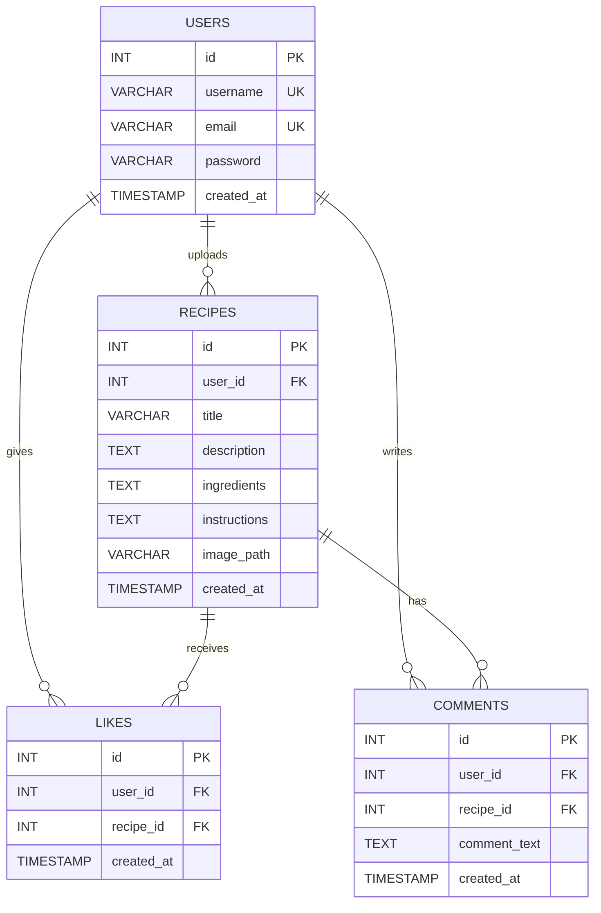

# ERD - Social Network of Recipes

## Relationships

| Relationship | Type | Description |
|---|---|---|
| USERS → RECIPES | 1:N | Ένας χρήστης ανεβάζει πολλές συνταγές |
| USERS → LIKES | 1:N | Ένας χρήστης κάνει πολλά likes |
| USERS → COMMENTS | 1:N | Ένας χρήστης γράφει πολλά σχόλια |
| RECIPES → LIKES | 1:N | Μία συνταγή λαμβάνει πολλά likes |
| RECIPES → COMMENTS | 1:N | Μία συνταγή έχει πολλά σχόλια |
| USERS ↔ RECIPES (via LIKES) | M:N | Πολλοί χρήστες κάνουν like σε πολλές συνταγές |
| USERS ↔ RECIPES (via COMMENTS) | M:N | Πολλοί χρήστες σχολιάζουν πολλές συνταγές |

## Constraints

- `likes.UNIQUE(user_id, recipe_id)` — Αποτρέπει διπλό like
- `ON DELETE CASCADE` — Διαγραφή χρήστη → διαγράφονται recipes, likes, comments
- `ON DELETE CASCADE` — Διαγραφή recipe → διαγράφονται likes, comments
